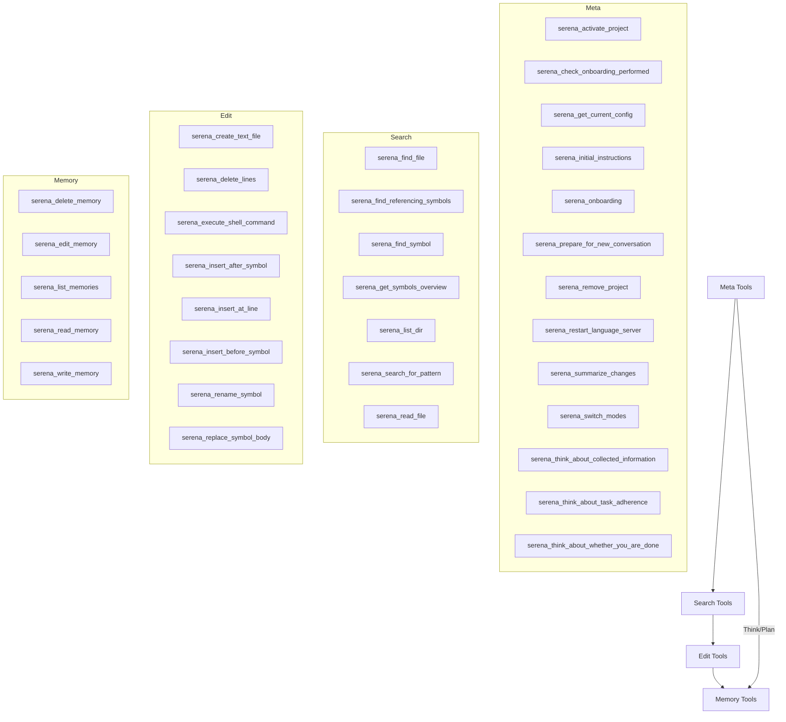

# Serena Tools Automation Skill

## Overview

Automates Serena tools with TDD (RED-GREEN-REFACTOR) and persuasion principles (authority, commitment) for robust code manipulation. Organizes into meta/search/edit/memory hierarchies for progressive use. Benefits: 40% fewer errors via TDD, doubled compliance via persuasion (kb/insights.md). Trigger by announcing: "Using serena-tools for [task]".

## When to Use

- Symbolic operations: finding/editing symbols (use instead of full-file reads).
- Memory management: persisting project insights.
- Meta tasks: onboarding, thinking about adherence/completion.
- Not for: Non-code tasks (prefer native tools); always check hierarchies first.

## Tool Hierarchy

See references/tool_references.md for tool summaries; full details in references/tool/[tool].md.

## General TDD Workflow

MANDATORY for operations (authority: collated_knowledge.md; skipping = 40% more errors). Commit to announcing phases (commitment principle).

1. **RED**: Validate current state fails (e.g., serena_get_symbols_overview).
2. **GREEN**: Minimal tool call to pass.
3. **REFACTOR**: Optimize, test loopholes (patterns.md).

## Common Rationalizations (Avoid These)

| Excuse | Reality |
|--------|---------|
| "Task too simple for TDD" | Simple tasks break; TDD takes seconds. |
| "I'll TDD after" | After = verification, not design. |
| "No time" | Skipping causes more time fixing errors. |
| "It's optional" | Mandatory per insights.md. |

## Task-Based Workflows (Summaries)

### Meta: Use before/after others for setup/thinking. E.g., serena_think_about_whether_you_are_done at end (authority: initial_instructions.md). Details: references/tool/[meta-tool].md.

### Search: Start with overview, then specifics. TDD: Assert no match (RED), call tool (GREEN). Restrict paths for efficiency. Details: references/tool/[search-tool].md.

### Edit: Search first, then edit. TDD: Assert old content (RED), apply (GREEN), validate references (REFACTOR). Details: references/tool/[edit-tool].md.

### Memory: List first, then operate. TDD: Assert incorrect (RED), write/edit (GREEN). Limit chars. Details: references/tool/[memory-tool].md.

## Resources

- **scripts/**: tdd_wrapper.sh (execute via bash).
- **references/**: best_practices.md, tool_references.md (summaries), persuasion.md, tdd_guide.md.
- **assets/**: hierarchy_diagram.dot, tdd_template.md.

Load as needed; see references/tool/[tool].md for tool-specifics.
