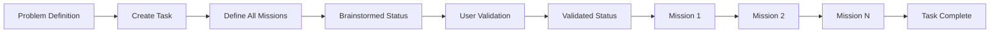
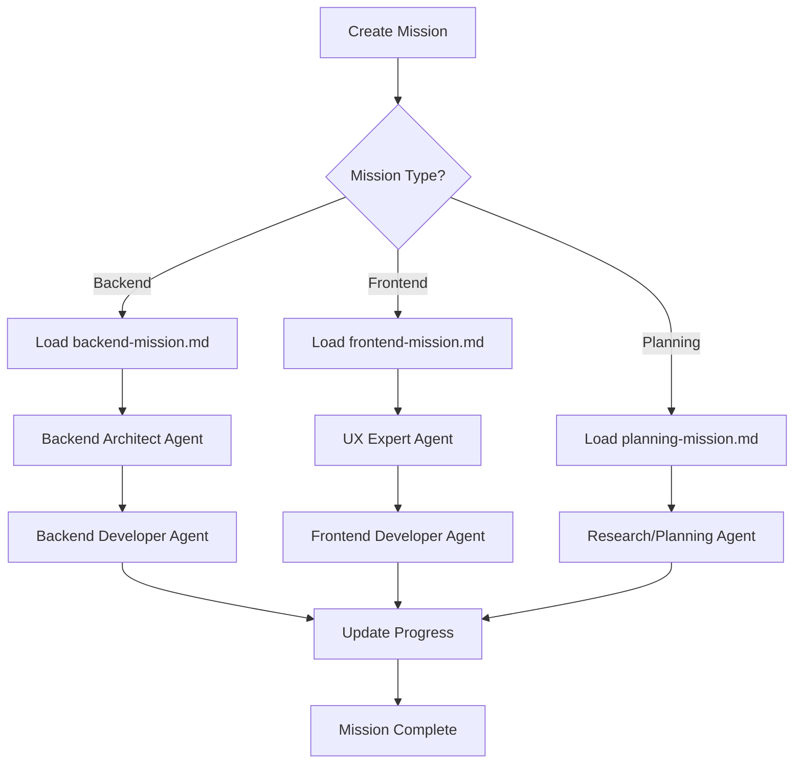
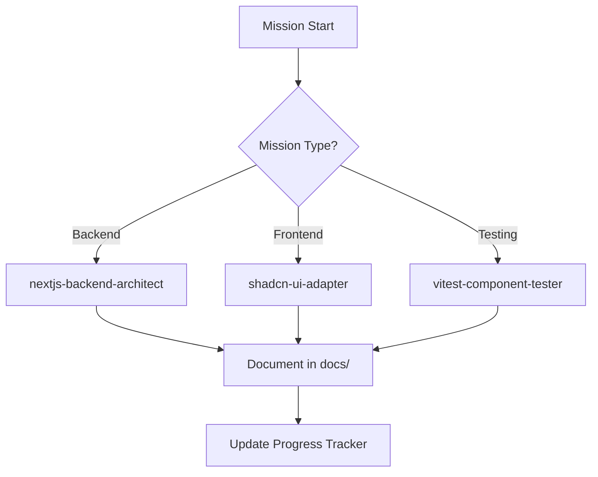

# 🚀 AB Method - Incremental Task Management System

> A revolutionary approach to software development that transforms problems into focused, incremental missions using Claude Code's specialized subagents.

## 🎯 Quick Installation

Install AB Method in your project with a single command:

```bash
npx ab-method
```

This will:
- ✅ Install all AB Method workflows in `.ab-method/`
- ✅ Add **11 slash commands** to Claude Code (both `/ab-master` and individual commands)
- ✅ Create necessary directories (`docs/architecture/`, `tasks/`)
- ✅ Set up or update `CLAUDE.md` with instructions
- ✅ Install builtin specialized agents for enhanced development workflow

After installation, open Claude Code and choose your preferred approach:

**Quick Access (NEW!):**
```bash
/create-task      # Create new tasks with technical details
/create-mission   # Transform tasks into focused missions
/extend-task      # Add new missions to existing tasks
/analyze-project  # Complete project analysis
# ... and 7 more individual commands
```

**Traditional Approach:**
```bash
/ab-master        # Master controller for all workflows
```

That's it! You're ready to start using the AB Method with enhanced command access.

## 📋 Table of Contents
- [Overview](#overview)
- [Core Philosophy](#core-philosophy)
- [System Architecture](#system-architecture)
- [Getting Started](#getting-started)
- [Workflow Files Documentation](#workflow-files-documentation)
- [Usage Examples](#usage-examples)
- [Task Lifecycle](#task-lifecycle)
- [Mission Execution Flow](#mission-execution-flow)
- [Architecture Documentation](#architecture-documentation)
- [Advanced Features](#advanced-features)

## 🎯 Overview

The AB Method is an incremental task management system designed specifically for Claude Code that breaks down complex software development projects into manageable tasks and missions. Each mission is completed entirely before moving to the next, building knowledge incrementally while maintaining focus and conserving context.

## 🧠 Core Philosophy

### Key Principles:
1. **One Task at a Time** - Maintain laser focus on a single task
2. **Incremental Missions** - Each mission builds on previous knowledge
3. **Backend First** - For full-stack tasks, start with backend to provide types and data
4. **Validation Checkpoints** - User validates before implementation begins
5. **Continuous Documentation** - Architecture and progress tracked in real-time

### Why AB Method?
- **Context Conservation** - Avoid overwhelming the model with too much planning
- **Knowledge Building** - Each mission uses learnings from previous ones
- **No Redundancy** - Prevent implementing the same thing twice
- **Clear Progress** - Always know exactly where you are

## 🏗️ System Architecture

```
.claude/
└── commands/
    ├── ab-master.md            # Traditional master controller
    ├── create-task.md          # Direct task creation
    ├── resume-task.md          # Resume existing tasks
    ├── create-mission.md       # Direct mission creation
    ├── resume-mission.md       # Resume missions
    ├── test-mission.md         # Create comprehensive tests
    ├── extend-task.md          # Add missions to existing tasks
    ├── analyze-project.md      # Full project analysis
    ├── analyze-frontend.md     # Frontend analysis
    ├── analyze-backend.md      # Backend analysis
    └── update-architecture.md  # Architecture updates

.ab-method/
├── core/                     # Core workflow files
│   ├── analyze-project.md    # Project analysis orchestrator
│   ├── analyze-frontend.md   # Frontend architecture analysis
│   ├── analyze-backend.md    # Backend architecture analysis
│   ├── update-architecture.md # Architecture documentation updater
│   ├── create-task.md        # Task creation workflow
│   ├── resume-task.md        # Task resumption workflow
│   ├── create-mission.md     # Mission creation workflow
│   ├── resume-mission.md     # Mission resumption workflow
│   └── extend-task.md        # Task extension workflow
│
├── utils/                    # Mission utility files
│   ├── backend-mission.md   # Backend mission coordinator
│   ├── frontend-mission.md  # Frontend mission coordinator
│   └── planning-mission.md  # Planning mission coordinator
│
├── structure/               # Configuration
│   └── index.yaml          # Paths and structure configuration


docs/
└── architecture/           # Generated architecture docs
    ├── tech-stack.md
    ├── entry-points.md
    ├── frontend-patterns.md
    ├── backend-patterns.md
    ├── external-services.md
    └── project-constraints.md

tasks/                      # Created tasks and missions
└── [task-name]/
    ├── progress-tracker.md
    └── mission-*.md
```

## 🚦 Getting Started

### Two Ways to Access Workflows

**🚀 Quick Access (Recommended for experienced users):**
```bash
/create-task        # Create new task with enhanced technical details
/resume-task        # Resume paused tasks
/create-mission     # Transform tasks into missions
/resume-mission     # Continue incomplete missions
/test-mission       # Create comprehensive tests
/extend-task        # Add new missions to existing tasks
/analyze-project    # Complete project analysis
/analyze-frontend   # Frontend architecture analysis
/analyze-backend    # Backend services analysis
/update-architecture # Maintain architecture docs
```

**📚 Traditional Controller (Great for beginners):**
```bash
/ab-master [workflow-name]
```

The master controller provides:
- View all available workflows (call without arguments)
- Start specific workflows with guidance (provide workflow name)
- Help text and workflow descriptions

### Available Workflows

| Workflow | Purpose | When to Use |
|----------|---------|-------------|
| `analyze-project` | Full project architecture analysis | Starting a new project or onboarding |
| `analyze-frontend` | Deep frontend analysis | Understanding client-side architecture |
| `analyze-backend` | Deep backend analysis | Understanding server-side architecture |
| `create-task` | Create a new development task | Starting new feature/fix |
| `resume-task` | Resume an existing task | Continuing previous work |
| `create-mission` | Create next mission for a task | Ready for next step |
| `resume-mission` | Resume an in-progress mission | Continuing mission work |
| `extend-task` | Add new missions to existing task | Requirements changed or scope expanded |
| `update-architecture` | Update architecture docs | After implementing features |

## 📁 Workflow Files Documentation

### Core Workflows

#### 🔍 `analyze-project.md`
**Purpose**: Orchestrates comprehensive project analysis using specialized subagents.

**Flow**:
1. Prompts user to confirm parallel agent deployment
2. Deploys frontend-developer and backend-architect agents simultaneously
3. Creates comprehensive architecture documentation

**Usage**:
```bash
/ab-master analyze-project
```

#### 📱 `analyze-frontend.md` & 💾 `analyze-backend.md`
**Purpose**: Deep-dive analysis of frontend/backend architecture.

**Key Features**:
- Reads from `.ab-method/structure/index.yaml` for output paths
- Creates detailed patterns documentation
- Identifies tech stack and conventions

#### 📝 `create-task.md`
**Purpose**: Creates a new task with all missions defined upfront.

**Task Status Flow**:
```
Brainstormed → Validated → In dev → Testing → Completed
```

**Process**:
1. Define problem statement, context, and expected outcome
2. Identify task type (Frontend/Backend/Full-stack)
3. Create all missions upfront
4. Initialize with "Brainstormed" status

#### 🔄 `resume-task.md` & `resume-mission.md`
**Purpose**: Resume work from exact breakpoint.

**Features**:
- Shows current progress visually
- Identifies last action and next step
- Maintains continuity across sessions

### Utility Files

#### 🔧 `backend-mission.md`
**Responsibilities**:
- Loads backend architecture documentation
- Coordinates backend-architect and backend-developer agents
- Ensures DTOs use database types for maintainability

#### 🎨 `frontend-mission.md`
**Responsibilities**:
- Loads frontend patterns and backend types
- Coordinates UX expert and frontend-developer agents
- Integrates with backend missions for type safety

#### 📊 `planning-mission.md`
**Responsibilities**:
- Loads ALL architecture documentation
- Handles research and design decisions
- Documents rationale and trade-offs

## 💡 Usage Examples

### Example 1: Starting a New Feature (Quick Style)

```bash
# 1. Create task directly with enhanced technical context
/create-task

# 2. System asks for problem definition + technical details
"Create a todos table that fetches from API and displays in frontend"
"Follow existing shadcn/ui patterns, use our current API structure"
"Testing with vitest, ensure responsive design"

# 3. Creates task with comprehensive technical context:
# Technical Context: Code constraints, architecture hints, tech requirements
# Code Guidance: File organization, testing requirements, performance
# - Mission 1: Backend - Create todo model and API
# - Mission 2: Frontend - Create table component  
# - Mission 3: Integration - Connect frontend to backend

# 4. System prompts for validation
"Task created with status 'Brainstormed'. Ready to validate?"

# 5. After validation, start first mission
/create-mission  # Deploys nextjs-backend-architect agent
```

### Example 1b: Starting a New Feature (Traditional Style)

```bash
# 1. Use master controller for guidance
/ab-master create-task

# 2. Same enhanced flow but with help text and explanations
# 3. Creates same comprehensive task documentation
# 4. Use /ab-master create-mission for guided mission creation
```

### Example 2: Resuming Work

**Quick Style:**
```bash
# Resume directly
/resume-task
> "Which task to resume?"
> "todo-table"

# Shows progress with agent tracking:
# ✓ Mission 1: Backend API - COMPLETED (nextjs-backend-architect)
# ⏳ Mission 2: Frontend Table - IN PROGRESS (shadcn-ui-adapter)  
#   Last: Created base component with shadcn/ui patterns
#   Next: Add state management and data fetching
#   Agent Output: Component documented in docs/tasks/todo-table/
```

**Traditional Style:**
```bash
# Resume with guidance
/ab-master resume-task
# Same progress display with helpful explanations
```

## 🔄 Task Lifecycle



## 🎯 Mission Execution Flow



## 📚 Architecture Documentation

The system automatically generates and maintains architecture documentation:

### Generated Files:
- **tech-stack.md** - Technologies, frameworks, and tools
- **entry-points.md** - API endpoints and application entries
- **frontend-patterns.md** - Component architecture and patterns
- **backend-patterns.md** - API design and service patterns
- **external-services.md** - Third-party integrations
- **project-constraints.md** - Limitations and requirements

### Update Strategy:
After implementing features, run:
```bash
/ab-master update-architecture
```

This will:
1. Assess impact of changes
2. Update relevant documentation
3. Preserve history with timestamps
4. Mark deprecated features

## 🚀 Advanced Features

### Specialized Sub-Agent System
The AB Method leverages Claude Code's specialized agents for enhanced development:

**Built-in Agents (Installed by default):**
- **shadcn-ui-adapter** - UI component creation and styling
- **nextjs-backend-architect** - Next.js backend development
- **sst-cloud-architect** - Serverless infrastructure
- **vitest-component-tester** - Component testing
- **playwright-e2e-tester** - End-to-end testing
- **ascii-ui-mockup-generator** - UI mockups and wireframes
- **mastra-ai-agent-builder** - AI agent development
- **qa-code-auditor** - Code quality analysis

**Agent Coordination Flow:**


### Comprehensive Documentation Output
All agent work is automatically documented in structured locations:

**Architecture Documentation:**
- `docs/architecture/` - Generated by analysis workflows
- Technical constraints, patterns, and tech stack details
- Updated continuously as missions complete

**Task Documentation:**
- `docs/tasks/[task-name]/` - Individual task folders  
- Progress trackers with technical context sections
- Mission-specific documentation with agent outputs

**Agent Output Tracking:**
Each mission tracks which agents were used and their contributions:
```markdown
## Agent Usage Tracking
### Mission 1 Agents
- nextjs-backend-architect: Created API endpoints and data models
- qa-code-auditor: Performed code quality analysis

## Sub-Agent Outputs
### Backend Architecture Plan (nextjs-backend-architect)
- Database schema: users, todos tables
- API endpoints: GET/POST /api/todos
- Type definitions: TodosTable, UserTable
```

### Enhanced Technical Context (NEW!)
Create-task workflow now includes comprehensive technical guidance:

**Technical Context Sections:**
- **Code Constraints** - File naming, coding standards, patterns
- **Architecture Hints** - Services to reuse, integration points  
- **Tech Stack Requirements** - Required libraries, versions, dependencies
- **API Constraints** - Endpoint naming, authentication patterns

**Code Guidance Sections:**  
- **File Organization** - Directory structure, import patterns
- **Testing Requirements** - Coverage expectations, test frameworks
- **Performance Considerations** - Caching, optimization requirements

### Parallel Agent Execution
The analyze-project workflow deploys multiple specialized agents in parallel for maximum efficiency:
- Frontend Expert Agent
- Backend Architect Agent

### Type Safety Across Stack
Backend missions generate types that frontend missions automatically use:
```typescript
// Backend creates:
interface Todo {
  id: string;
  title: string;
  status: TodosTable["status"]; // Database type
}

// Frontend uses:
const TodoList: React.FC<{ todos: Todo[] }> = ...
```

### Incremental Knowledge Building
Each mission document contains:
- Dependencies from previous missions
- Files created/modified
- Architectural decisions
- Test results
- Agent contributions and outputs

### Configuration Flexibility
The `.ab-method/structure/index.yaml` file allows customization of:
- Documentation paths
- Task folder structure
- Workflow output locations

## 🔧 Configuration

### Structure Index (`.ab-method/structure/index.yaml`)
```yaml
project_structure:
  docs:
    architecture:
      files:
        - tech-stack.md
        - entry-points.md
        # ... more files

workflow_outputs:
  analyze-project: docs/architecture/
  analyze-frontend: docs/architecture/frontend-patterns.md
  # ... more mappings
```

## 📈 Best Practices

1. **Choose your preferred command style:**
   - **Quick**: Use direct commands like `/create-task`, `/analyze-project`
   - **Guided**: Use `/ab-master` for help and workflow descriptions

2. **Complete missions sequentially** - Don't skip ahead, each builds on the previous

3. **Validate before implementing** - Review plans and technical context before execution

4. **Leverage technical context** - Fill in code constraints, architecture hints, and testing requirements during task creation

5. **Trust the agent coordination** - Let specialized agents handle their domains (UI, backend, testing)

6. **Review documentation outputs** - Check `docs/` folders for agent-generated architecture and technical details

7. **Update architecture regularly** - Use `/update-architecture` after major changes

8. **Use backend types in frontend** - Maintain type safety across the stack

## 🤝 Contributing

The AB Method is continuously evolving. Key areas for improvement:
- Cleaner diagram organization
- Additional mission types
- Enhanced agent coordination
- Better progress visualization

## 📝 Notes

- The system uses Claude Code's subagent capabilities extensively
- All paths are configurable via `index.yaml`
- Mission workflows delegate architecture reading to utils files
- Each workflow checks `.ab-method/structure/index.yaml` first

## 🎉 Getting Started Checklist

- [ ] Install: `npx ab-method` (includes builtin agents)
- [ ] Choose your style: Direct commands (`/create-task`) or guided (`/ab-master`)
- [ ] Start with `/analyze-project` for new projects (creates architecture docs)
- [ ] Create your first task with `/create-task` (includes technical context)
- [ ] Fill in technical constraints and code guidance during task creation
- [ ] Validate before starting implementation  
- [ ] Let specialized agents handle missions (creates documentation in `docs/`)
- [ ] Complete missions one at a time, review agent outputs
- [ ] Use `/update-architecture` after major changes

---

**Remember**: The AB Method is about focused, incremental progress. One task, one mission, one step at a time. Each building on the last, creating a robust and maintainable codebase.
